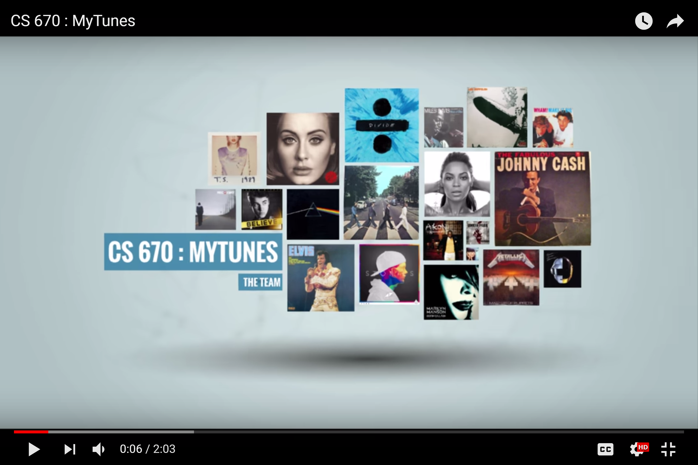

# CS670MyTunes

This is a project for the Information Search and Retrieval.

We are designing a Music recommender system. The reference paper of which can be found here 

[Beyond “Hitting the Hits” – Generating Coherent Music
Playlist Continuations with the Right Tracks](http://dl.acm.org/ft_gateway.cfm?id=2800182&ftid=1617858&dwn=1&CFID=752043362&CFTOKEN=54153428)

published in RecSys '15.

We are trying to mimic the result on the,

AoTM Dataset
LastFM Dataset

## Dataset
[Link to Dataset Files](https://drive.google.com/open?id=0By5IpBdZIzdZWUVqYzZtam5DcGs)

## Video Presentation

